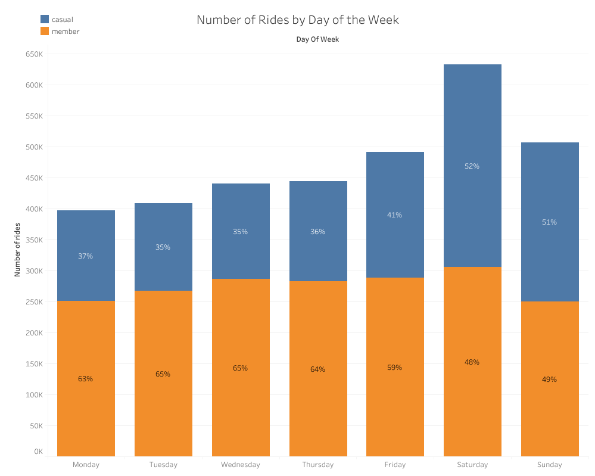
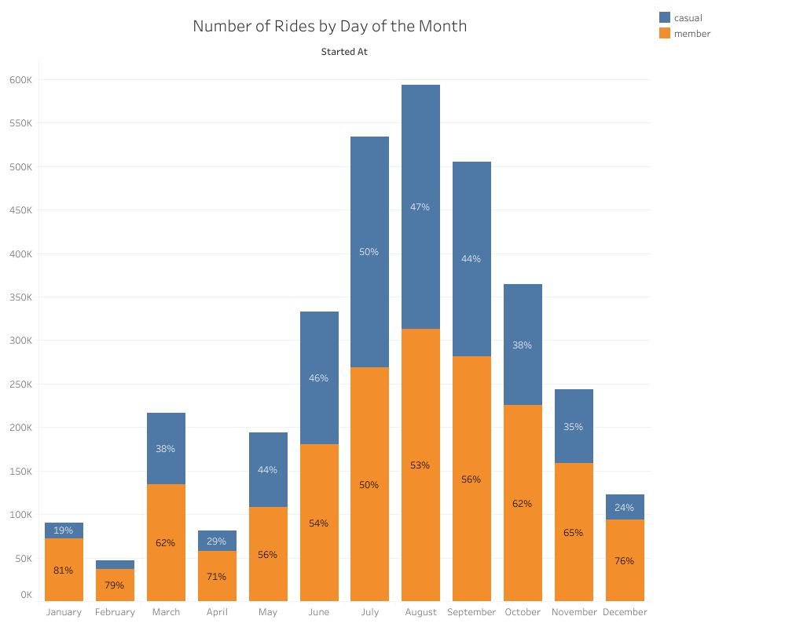
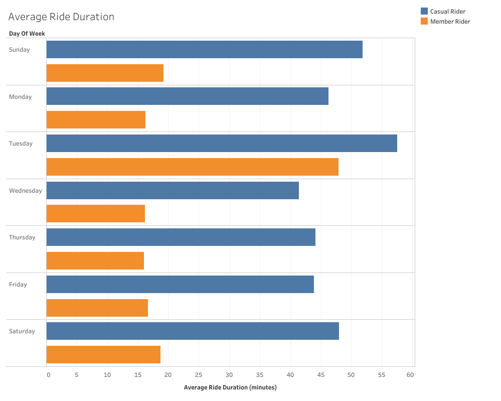

#Bike Share Case-study

:warning: Work in Progress! :rescue_worker_helmet:

Here I took publicly available data from a Bike share company, and looked to answer a few questions:                         

  * How do customers with annual memberships differ from one-time users?
  * What kind of trends do we notice in customer behaviour?

After cleaning the data, I wanted to breakdown how customers are using the bikes. 
<p align="center">

</p>
We can see here how most bikes are rented on a Saturday, with the number of membership riders fairly constant through the week.
Weekdays we see a proportionaly higher amount of membership riders. This could be because people are using them to commute.

</p>
<p align="center">

</p>

Here we can see that the share of users with memberships is much higher in the winter months (Dec, Jan, Feb). We can judge from this that casual usage is highly weather dependent. We can also see a large spike in March. It would be worth researching if there were any reasons why this could be, such as uncharacteristically good weather, or any large special events.
 
  </p>
   *
   *
   *
  
  

This R script compares the average ride durations of casual users and users with the annual membership:
```
data %>%
  mutate('duration' = (ended_at - started_at)) %>%
  group_by(member_casual) %>%
  summarise(mean(duration))
```
From this we get the following results:
```
  member_casual `mean(duration)`
  <chr>         <drtn>
1 casual        2597.2869 secs
2 member         714.1319 secs
```
As we can see, the casual rider on average uses the bike for much longer than the rider with the annual membership. But how does this breakdown over the week?
</p>
<p align="center">

</p>


//Currently being edited//
