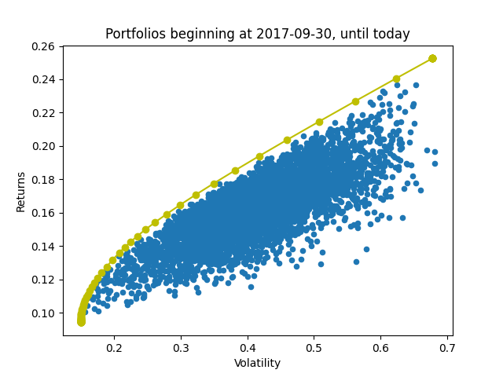
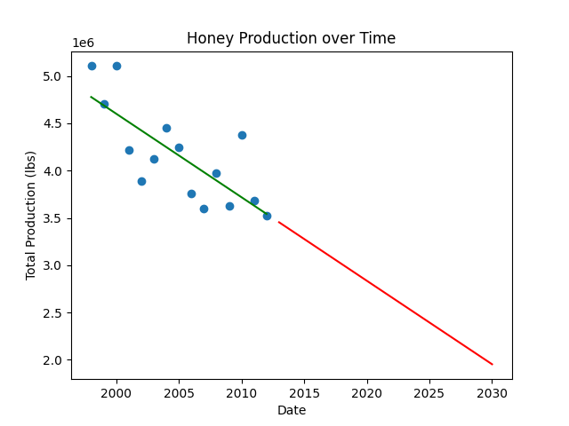

## Hello!
My name is Johnny, and I am building a portfolio of Data Analysis/Data science projects. I have proficiency in Python, R, SQL, and a particular interest in finance and cryptocurriency, feel free to send me a message at duffy.johnny@gmail.com
Thanks!

# [Bike Share Case-Study](https://github.com/JohnnyDuffy/DataPortfolio/tree/main/Bike%20Share%20Case-study)
* Clean, Analyse, and Visualise publicly available data on Bike Sharing company
* Here I use R to clean and reorganise the data, and Tableau to create visualisations and a dashboard

# [Crypto Market Analysis](https://github.com/JohnnyDuffy/Portfolio/blob/main/CryptoMarketAnalysis.py)
* Use Python script to retrieve live data for any user specified cryptocurrencies
* Scales price data, and calculates correlation and cumulative returns of each asset. 
* The cumulative returns plot can be swapped out to a bar chart

# [Portfolio Optimisation](https://github.com/JohnnyDuffy/DataPortfolio/blob/main/PortfolioOptimisation/PortfolioOptimiser.py)
* Retrieves live data for a user specified portfolio of stocks and crypto assets
* Organises and manipulates data with Pandas and NumPy
* Calculates returns and covariance
* Generates 5000 portfolios and calculates weighting for optimum risk adjusted returns

# [Regression: Analysing Honey Production Over Time](https://github.com/JohnnyDuffy/DataPortfolio/blob/main/LinearRegression/Regression.py)
* Extracts and reorganises data with Python
* Generates linear regression model using sklearn
* Identifies trend direction by plotting line of best fit
* Extrapolates data into the future

